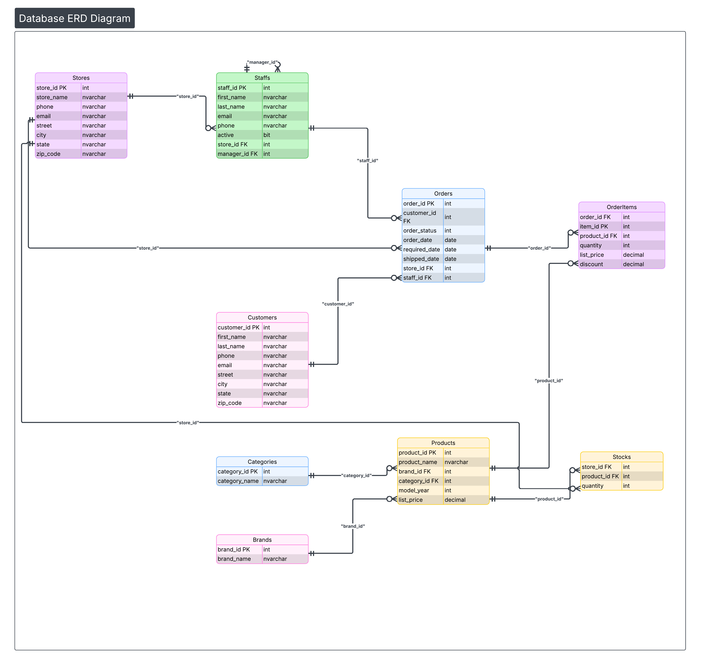
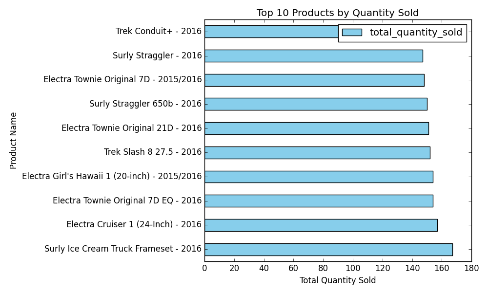
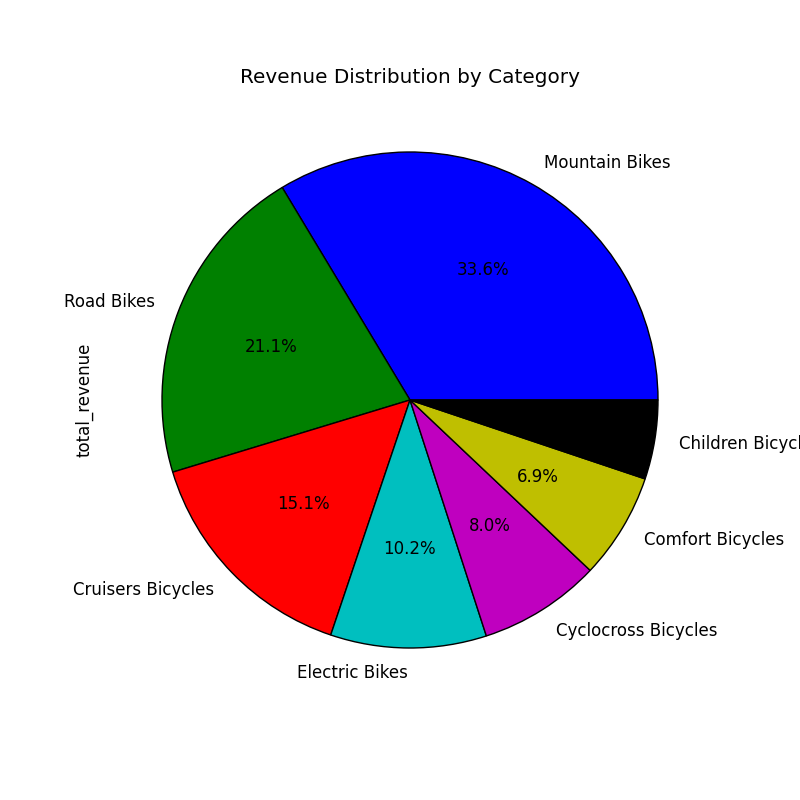
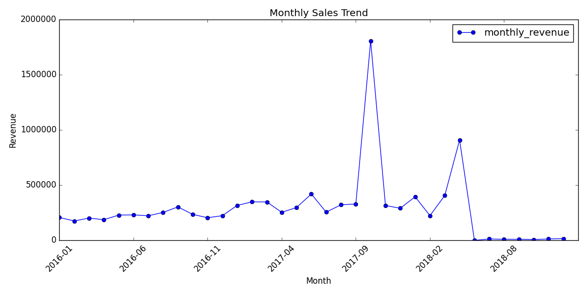

# 🏬 Retail Store Data Pipeline & Analysis

An end-to-end **ETL & Analytics project** that ingests raw retail CSV data, cleans and transforms it using **Python & Pandas**, loads it into **SQL Server**, and generates **business-ready insights and visualizations**.

This project was built as a **capstone-style data engineering & analytics project**, demonstrating real-world practices in data cleaning, relational database design, and SQL-based analysis.

---

## 📌 Project Highlights

* 🔄 Full **ETL pipeline** (Extract → Transform → Load)
* 🧹 Robust data cleaning (missing values, duplicates, types, outliers)
* 🗃️ Relational database design (**3NF**, PKs & FKs)
* 📊 Business-focused SQL analytics
* 📈 Python visualizations with Matplotlib
* 🧠 Clear separation between **pipeline**, **analysis**, and **reporting**

---

## 📑 Table of Contents

1. [Project Overview](#project-overview)
2. [Dataset Description](#dataset-description)
3. [Technologies Used](#technologies-used)
4. [Architecture & Data Flow](#architecture--data-flow)
5. [Project Structure](#project-structure)
6. [Database Design](#database-design)
7. [Installation & Setup](#installation--setup)
8. [How to Run the Project](#how-to-run-the-project)
9. [Data Pipeline Steps](#data-pipeline-steps)
10. [Analysis & Visualizations](#analysis--visualizations)
11. [Key Results](#key-results)
    
---

## 📋 Project Overview

This project implements a complete **retail data pipeline**:

1. Load **9 raw CSV files** containing retail data
2. Clean and standardize the data
3. Apply required business transformations
4. Load cleaned data into **SQL Server (RetailDB)**
5. Execute analytical SQL queries
6. Generate plots and summary reports using Python

📆 **Time Range:** 2016 – 2018
📦 **Volume:** ~10,000+ records across all tables

---

## 📊 Dataset Description

The dataset represents a multi-store retail business and includes:

* Products, brands, and categories
* Customers and orders
* Order line items
* Stores, staffs, and inventory (stocks)

All datasets were provided in raw CSV format and required extensive preprocessing.

---

## 🛠️ Technologies Used

| Category         | Tools                      |
| ---------------- | -------------------------- |
| Programming      | Python 3.8+, Pandas, NumPy |
| Database         | SQL Server 2019+           |
| ORM / Connection | SQLAlchemy, ODBC Driver 17 |
| Analysis         | SQL, Pandas                |
| Visualization    | Matplotlib                 |
| Environment      | Jupyter Notebook           |

---

## 🏗️ Architecture & Data Flow

```
CSV Files
   ↓
Pandas (Cleaning & Transformation)
   ↓
Cleaned CSV Files
   ↓
SQL Server (RetailDB)
   ↓
SQL Analysis Queries
   ↓
Python Reports & Visualizations
```

---

## 📁 Project Structure

```
retail-store-data-pipeline/
├── README.md
├── requirements.txt
├── notebooks/
│   ├── 01_data_pipeline.ipynb   # ETL: Load, Clean, Transform, Load
│   └── 02_final_report.ipynb    # Analysis & Visualizations
├── Source_Data/                 # Raw CSV files (9 files)
├── cleaned_data/                # Cleaned CSV outputs
├── SQL_Scripts/
│   ├── 01_init_database.sql
│   ├── 02_ddl_queries.sql
│   └── 03_analysis_queries.sql
├── reports/
│   ├── plots/                   # Generated visualizations
│   └── tables/                  # CSV analysis outputs
└── images/
    └── erd_diagram.png
```

---

## 🗃️ Database Design

### Entity Relationship Diagram (ERD)



**Design Principles Applied:**

* Third Normal Form (**3NF**)
* Proper use of **Primary & Foreign Keys**
* Composite primary keys where applicable
* Self-referencing foreign key in `Staffs.manager_id`

### Tables Overview

| Table      | Records | Description         |
| ---------- | ------- | ------------------- |
| Brands     | 9       | Product brands      |
| Categories | 7       | Product categories  |
| Stores     | 3       | Retail stores       |
| Products   | 321     | Products catalog    |
| Staffs     | 10      | Store employees     |
| Customers  | 1,445   | Customer data       |
| Orders     | 1,615   | Sales orders        |
| OrderItems | 4,722   | Order line items    |
| Stocks     | 939     | Inventory per store |

---

## 🚀 Installation & Setup

### 1️⃣ Clone Repository

```bash
git clone https://github.com/mahmoudgml/retail-store-data-pipeline.git
cd retail-store-data-pipeline
```

### 2️⃣ Install Dependencies

```bash
pip install -r requirements.txt
```

### 3️⃣ SQL Server Setup

```bash
sqlcmd -S localhost -i SQL_Scripts/01_init_database.sql
sqlcmd -S localhost -d RetailDB -i SQL_Scripts/02_ddl_queries.sql
```

⚠️ Ensure SQL Server is running and **ODBC Driver 17** is installed.

---

## 💻 How to Run the Project

### Run ETL Pipeline

1. Open `notebooks/01_data_pipeline.ipynb`
2. Run all cells sequentially
3. Cleaned data is saved and loaded into SQL Server

### Run SQL Analysis

```bash
sqlcmd -S localhost -d RetailDB -i SQL_Scripts/03_analysis_queries.sql
```

### Generate Reports

1. Open `notebooks/02_final_report.ipynb`
2. Run all cells
3. Outputs are saved in the `reports/` directory

---

## 🔄 Data Pipeline Steps

### 1. Extract

* Load all CSV files using Pandas
* Standardize column names

### 2. Clean

* Handle missing values
* Remove duplicates
* Fix data types
* Validate foreign keys
* Remove invalid quantities and prices

### 3. Transform

* `total_price = quantity × list_price`
* Calculate `order_total_amount`
* Create customer `full_name`
* Normalize phone numbers

### 4. Load

* Load cleaned data into SQL Server using SQLAlchemy

---

## 📊 Analysis & Visualizations

### Sales Analysis
* **Top 10 Best-Selling Products**
  

* **Top 5 Customers by Spending**
  

* **Revenue per Store**
  

* **Revenue per category**
  
  
* **Monthly Sales Trend**
  

### Inventory Analysis

* Products with low stock
* Stores with highest inventory

### Staff Performance

* Orders handled per staff
* Best-performing staff by revenue

### Customer Insights

* Customers with no orders
* Average spending per customer

---

## 📈 Key Results

* ✅ 9 tables successfully loaded
* ✅ 47 duplicate rows removed
* ✅ 0 missing values after cleaning
* ✅ 11+ analytical SQL queries executed
* ✅ 5 business-ready visualizations generated

---

## 📬 Contact

📧 Email: [mahmoud23456123@gmail.com](mailto:mahmoud23456123@gmail.com)
🔗 LinkedIn: [https://www.linkedin.com/in/mahmoudgamalsaad](https://www.linkedin.com/in/mahmoudgamalsaad)
