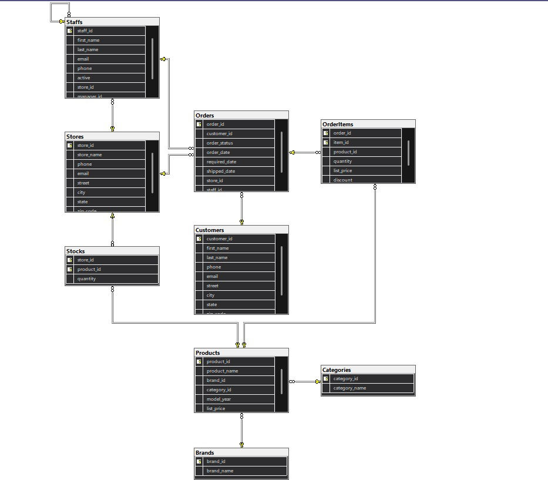

# Retail Store Data Pipeline & Analysis

A complete end-to-end data pipeline for retail store analysis using Python, Pandas, and SQL Server.

---

## 📋 Project Overview

This project builds a data pipeline to:
- Load and clean retail store data (9 CSV files)
- Transform data and create calculated fields
- Load data into SQL Server database
- Perform analytical queries for business insights

**Dataset:** 2016-2018 retail store data with 10,000+ records

---

## 🛠️ Technologies Used

- **Python 3.8+** (Pandas, NumPy, SQLAlchemy)
- **SQL Server 2019+**
- **Jupyter Notebook**

---

## 📁 Project Structure

```
retail-store-data-pipeline/
├── README.md
├── requirements.txt
├── notebooks/
│   ├── 01_data_pipeline.ipynb       # Main pipeline
│   └── 02_final_report.ipynb        # Analysis reports (bonus)
├── data/                             # Raw CSV files (9 files)
├── cleaned_data/                     # Cleaned CSV files (9 files)
├── sql/
│   ├── 01_create_database.sql
│   ├── 02_create_schema.sql
│   └── 03_analysis_queries.sql
├── reports/                          # Generated reports and plots
└── images/                           # Database diagrams
    ├── erd_diagram.png
    └── database_schema.png
```

---

## 🗃️ Database Design

### Entity Relationship Diagram (ERD)


The database follows **Third Normal Form (3NF)** with proper relationships between tables.

**Tables:**
- **Brands** (9 records)
- **Categories** (7 records)  
- **Stores** (3 records)
- **Products** (321 records) → References Brands & Categories
- **Staffs** (10 records) → References Stores
- **Customers** (1,445 records)
- **Orders** (1,615 records) → References Customers, Stores, Staffs
- **OrderItems** (4,722 records) → References Orders & Products
- **Stocks** (939 records) → References Stores & Products


---
### Database Schema Diagram



**Key Features:**
- ✅ Primary Keys on all tables
- ✅ Foreign Keys with proper constraints
- ✅ Indexes for query optimization
- ✅ Composite Primary Keys (OrderItems, Stocks)
- ✅ Self-referencing FK (Staffs.manager_id)

---

## 🚀 Installation

### 1. Clone the repository
```bash
git clone https://github.com/YOUR_USERNAME/retail-store-data-pipeline.git
cd retail-store-data-pipeline
```

### 2. Install dependencies
```bash
pip install -r requirements.txt
```

### 3. Setup SQL Server
```bash
sqlcmd -S localhost -i sql/01_create_database.sql
sqlcmd -S localhost -d RetailDB -i sql/02_create_schema.sql
```

---

## 💻 Usage

### Run the pipeline:
1. Open `notebooks/01_data_pipeline.ipynb`
2. Run all cells sequentially
3. Data will be cleaned and loaded to SQL Server

### Run analysis queries:
```bash
sqlcmd -S localhost -d RetailDB -i sql/03_analysis_queries.sql
```

### Generate reports (bonus):
1. Open `notebooks/02_final_report.ipynb`
2. Run all cells to generate plots and reports

---

## 🔄 Data Pipeline

### 1. Data Loading
- Load 9 CSV files (Brands, Categories, Products, Customers, Orders, OrderItems, Staffs, Stores, Stocks)
- Standardize column names

### 2. Data Cleaning
- Handle missing values (phone, email)
- Clean phone numbers (remove spaces, extract first number)
- Convert data types (IDs → int, dates → datetime, prices → float)
- Remove duplicates and negative quantities
- Remove unrealistic values

### 3. Data Transformation
- Calculate `total_price` = quantity × list_price × (1 - discount)
- Calculate `order_total_amount` per order
- Create `full_name` column for customers

### 4. Export & Load
- Save cleaned data as CSV files
- Load all tables to SQL Server

---

## 📊 Analysis Queries

### Sales Analysis
1. Top 10 best-selling products
2. Top 5 customers by spending
3. Revenue per store
4. Revenue per category
5. Monthly sales trend

### Inventory Analysis
6. Products with low stock (< 10 units)
7. Stores with highest inventory levels

### Staff Performance
8. Orders handled by each staff member
9. Best performing staff by total sales

### Customer Insights
10. Customers with no orders
11. Average spending per customer

---

## 📈 Key Results

- **9 tables** cleaned and loaded to SQL Server
- **0 missing values** (handled appropriately)
- **47 duplicate rows** removed
- **11+ analytical queries** executed successfully
- **6 visualizations** generated (bonus)

---

## Contact

* **LinkedIn:**
  [https://www.linkedin.com/in/mahmoudgamalsaad](https://www.linkedin.com/in/mahmoudgamalsaad)

* **Email:**
  [mahmoud23456123@gmail.com](mailto:mahmoud23456123@gmail.com)

---
